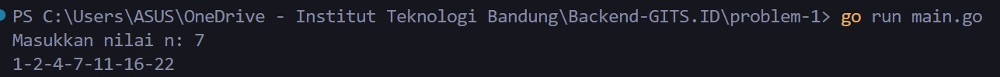
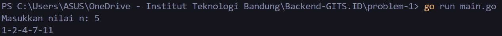
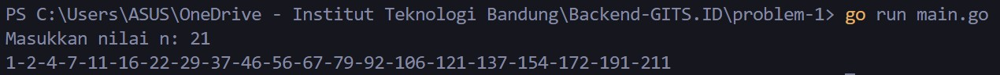

<div align="center">
    <h1>GITS.id - Backend Intern Test</h1>
    <h3>Problem 1 - A000124 of Sloane’s OEIS</h3>
    <p>Created by Mohammad Akmal Ramadan</p>
</div>

## Instruction 🎆
Buatlah sebuah program dengan output sebagai berikut. Input bisa dinamis yang menghasilkan output yang berbeda-beda sesuai input yang dimasukan. Gunakan rumus A000124 of Sloane’s OEIS.

## Input and output examples 🧑🏾‍💻
Input:
   ```sh
  7
   ```
Output:
   ```sh
  1-2-4-7-11-16-22
   ```
## Output screenshots 🔨
1:


2:


3:


