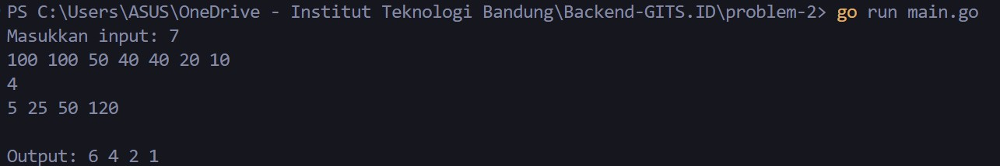
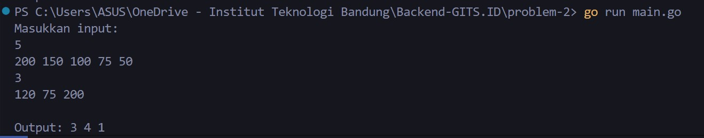
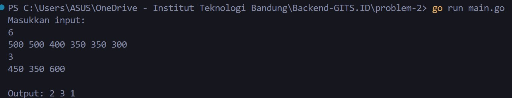

<div align="center">
    <h1>GITS.id - Backend Intern Test</h1>
    <h3>Problem 2 - Dense Ranking</h3>
    <p>Created by Mohammad Akmal Ramadan</p>
</div>

## Instruction 🎆
GITS sedang bermain permainan arcade, dan dalam setiap permainan GITS ingin naik ke peringkat tertinggi dan juga ingin mengetahui setiap peringkat di setiap permainan. Dalam permainan ini menggunakan skema Dense Ranking​ dan memiliki aturan sebagai berikut:
- Peringkat pertama dapat diraih oleh pemain yang memiliki skor tertinggi
- Pemain yang memiliki skor yang sama memiliki peringkat yang sama.

Contoh :
- Empat pemain memiliki skor tertinggi sebagai berikut 100, 80, 80, dan 70, maka masing-masing pemain itu memiliki rangking 1,2,2 dan 3. Jika GITS memiliki skor 60, 70, 100 setelah pertandingan maka rangking yang didapatkan adalah 4, 3 dan 1.

## Input and output examples 🧑🏾‍💻
Input:
   ```sh
  7

  100 100 50 40 40 20 10 

  4

  5 25 50 120
   ```
Output:
   ```sh
  6 4 2 1
   ```
## Output screenshots 🔨
1:


2:


3:


