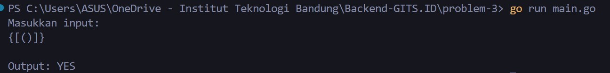
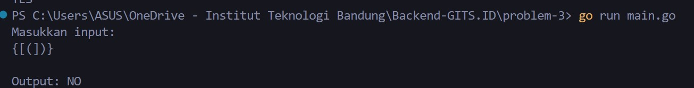

<div align="center">
    <h1>GITS.id - Backend Intern Test</h1>
    <h3>Problem 3 - Balanced Bracket</h3>
    <p>Created by Mohammad Akmal Ramadan</p>
</div>

## Instruction 🎆
Sampe 1:
Input: { [ ( ) ] } 
Output: YES 
Penjelasan: Setiap bracket seimbang, antara bracket buka dan bracket tutup. 
opening : { } 
opening : [ ] 
opening : ( } 

Sampel 2: 
Input: { [ ( ] ) } 
Output: NO 
Penjelasan: String { [ ( ] ) } tidak seimbang untuk karakter yang diapit oleh { dan } yaitu [ ( ] ).

Sampel 3: 
Input: { ( ( [ ] ) [ ] ) [ ] } 
Output: YES 
Penjelasan: Setiap bracket seimbang, antara bracket buka dan bracket tutup, meskipun struktur bracket tidak beraturan.

Aturan: 
1. Tanda bracket / karakter yang diperbolehkan sebagai berikut: ( , ) , { , } , atau [ , ]. 
2. Bracket bisa dipisahkan dengan atau tanpa whitespace. 
3. Periksa tanda kurung yang memiliki kecocokan antara bracket buka dan bracket tutup dengan mengembalikan nilai string YES atau NO.

Soal:
1. Buat fungsi untuk menemukan Balanced Bracket dengan kompleksitas paling rendah!
2. Berapa ukuran kompleksitas kodinganmu? Jelaskan detail kompleksitas jawaban No.3, cantumkan di README Repo!

## Kompleksitas 🧑🏾‍💻
- **Kompleksitas Waktu**: O(n), di mana **n** adalah panjang string. Program hanya memerlukan satu iterasi untuk memproses string.
- **Kompleksitas Ruang**: O(n), di mana **n** adalah jumlah karakter dalam string, karena kita menyimpan karakter pembuka dalam stack.

## Output screenshots 🔨
1:


2:


3:


## How to run 🏃🏼‍♂️💨
1. Run this command:
```bash
go run main.go
```
